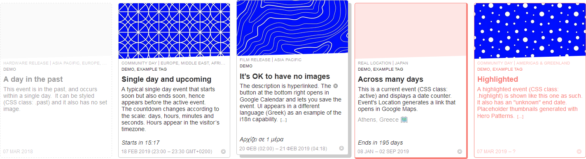
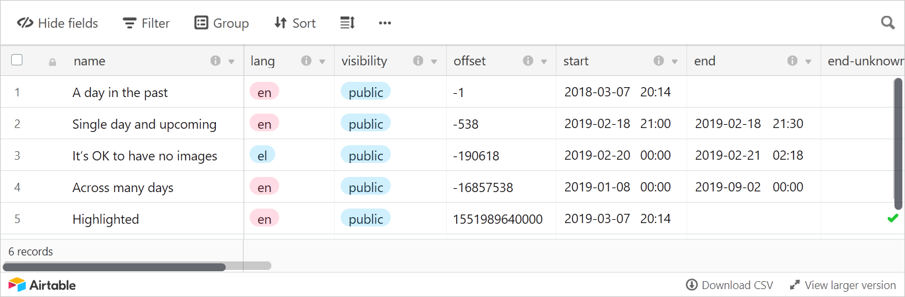

# /aircalendar

A card based calendar, powered by an [Airtable](https://airtable.com/invite/r/aUWahaKr). It includes helpful details such as countdowns, Google Calendar links, auto-magical sorting. See the demo at [https://arty2.github.io/aircalendar/](https://arty2.github.io/aircalendar/)

Plug in a specific Airtable view and make use of it’s filters. In the example provided, events are sorted with the following formula: `IF(NOW()<{end}, DATETIME_DIFF(NOW(),{end}) , IF({end},-1,IF(NOW()<{start},DATETIME_FORMAT({start},'x'),IF({end-unknown},DATETIME_DIFF(NOW(),DATEADD(NOW(),3,'days')),-1))) )` that gives priority to events that end soon, and moves upcoming events to the top, even if they haven’t started yet.

This script and [its related Airtable base](https://airtable.com/shrTbeziWF56USaZd) may change breaking compatibility. Designed with multilingual websites (i18n) in mind. Underlying code is quickly hacked together, but fully functional and should work even with missing fields.

⚠️ This is not a plug & play solution. Requires [jQuery](https://jquery.com/), [airtable.browser.js](https://github.com/airtable/airtable.js/) and a modified version of [date.format.js](./date.format.js) (included). WARNING: By using your key in this script, you allow anyone to view (or edit) your base! Make sure your API (thus user) has read-only access!

## To-do

- [ ] Better settings
- [ ] Translatable event summary
- [ ] Translatable tags
- [ ] Manual text override for dates (e.g. “Next Week”, “Up next”)
- [ ] Autoupdating upcoming field
- [ ] Reccuring events
- [ ] Handling of connection errors

## Credits

- [date.format.js](http://blog.stevenlevithan.com/archives/date-time-format) by [Steven Levithan](http://stevenlevithan.com)

© 2019 [Heracles Papatheodorou](http://heracl.es) a.k.a [@Arty2](https://www.twitter.com/Arty2), [MIT Licence](LICENCE.txt)